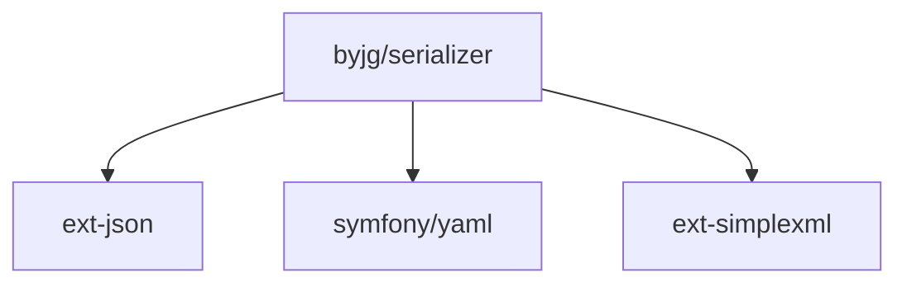

# Serializer

[](https://github.com/byjg/serializer/actions/workflows/phpunit.yml)
[](http://opensource.byjg.com)
[](https://github.com/byjg/serializer/)
[](https://opensource.byjg.com/opensource/licensing.html)
[](https://github.com/byjg/serializer/releases/)

Serialize any object into array and format it JSON, YAML or XML

## Converting any object/content into array

Just use the Serializer class with any kind of object, stdClass or array;

```php
<?php
$result = \ByJG\Serializer\Serialize::from($data)->toArray();
$result2 = \ByJG\Serializer\Serialize::fromPhpSerialize($anyPhpSerializedString)->toArray();
$result2 = \ByJG\Serializer\Serialize::fromJson($anyJsonString)->toArray();
$result3 = \ByJG\Serializer\Serialize::fromYaml($anyYamlString)->toArray();
```

In the examples above `$result`, `$result2` and `$result3` will be an associative array.

## Formatting an array into JSON, YAML or ZML

```php
<?php
$data = [ ... any array content ... ]

echo (new JsonFormatter())->process($data);
echo (new XmlFormatter())->process($data);
echo (new YamlFormatter())->process($data);
echo (new PlainTextFormatter())->process($data);
```

or you call directly from the Serializer:

```php
<?php
$data = [ ... any array content ... ]

echo Serialize::from($data)->toJson();
echo Serialize::from($data)->toXml();
echo Serialize::from($data)->toYaml();
echo Serialize::from($data)->toPlainText();
```

## Customizing the Serialization

### Ignore null elements: `withDoNotSerializeNull()`

The SerializerObject brings all properties by default. For example:

```php
<?php
$myclass->setName('Joao');
$myclass->setAge(null);

$serializer = new \ByJG\Serializer\Serialize($myclass);
$result = $serializer->toArray();
print_r($result);

// Will return:
// Array
// (
//     [name] => Joao
//     [age] => 
// )
```

But you can setup for ignore the null elements:

```php
<?php
$result = \ByJG\Serializer\Serialize::from($myclass)
            ->withDoNotNullValues()
            ->toArray();
print_r($result);

// And the result will be:
// Array
// (
//     [name] => Joao
// )

```

### Do not parse some classes: `withDoNotParse([object])`

Sometimes we want to serialize the object but ignore some class types.

Setting this option below the whole classes defined in the setDoNotParse will be ignored and not parsed:

```php
<?php
$result = \ByJG\Serializer\Serialize::from($myclass)
            ->withDoNotParse([
                MyClass::class
            ])
            ->toArray();
```

## Create a class can copy from/to any object

Add to the object the method `copyFrom` and `copyTo` that allows set property contents from/to another object

```php
<?php
// Create the class
class MyClass extends ObjectCopy
{}

// Copy the properties from $data into the properties that match on $myclass
$myclass->copyFrom($data);

// Copy the properties from $myclass into the properties that match on $otherObject
$myclass->copyTo($otherobject);
```

## Copy contents from any object to another

```php
// Set all properties from $source that matches with the property in $target
ObjectCopy::copy($source, $target);

// Convert all properties of any object into array
SerializerObject::from($source)->toArry;
```

### Copy contents from an object with CamelCase properties to another with snake_case properties

```php
class Source
{
    public $idModel;
    public $clientName;
    public $age;
}

class Target
{
    public $id_model;
    public $client_name;
    public $age;
}

$source = new Source();
$source->idModel = 1;
$source->clientName = 'John';
$source->age = 30;

ObjectCopy::copy($source, $target, new CamelToSnakeCase());
```

### Copy contents from an object with snake_case properties to another with CamelCase properties

```php
class Source
{
    public $id_model;
    public $client_name;
    public $age;
}

class Target
{
    public $idModel;
    public $clientName;
    public $age;
}

$source = new Source();
$source->id_model = 1;
$source->client_name = 'John';
$source->age = 30;

ObjectCopy::copy($source, $target, new SnakeToCamelCase());
```


## Install

```
composer require "byjg/serialize"
```

## Test

```
./vendor/bin/phpunit
```

## Dependencies



----
[Open source ByJG](http://opensource.byjg.com)
