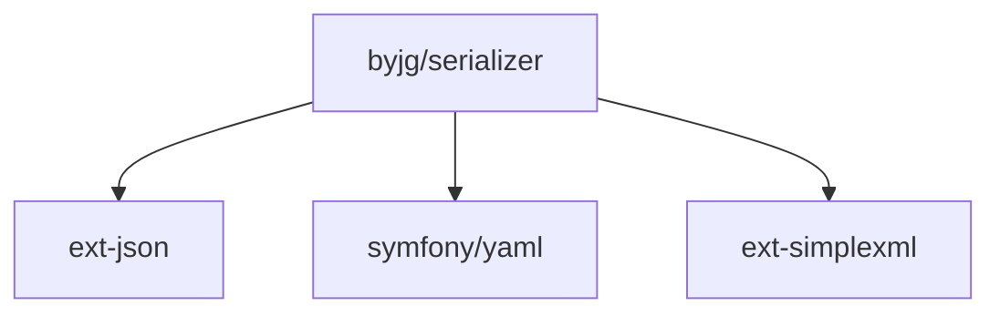

# PHP Serializer

[](https://github.com/byjg/php-serializer/actions/workflows/phpunit.yml)
[](http://opensource.byjg.com)
[](https://github.com/byjg/php-serializer/)
[](https://opensource.byjg.com/opensource/licensing.html)
[](https://github.com/byjg/serializer/releases/)

A powerful PHP library for seamless object serialization, conversion, and property manipulation.

## Overview

The PHP Serializer library provides a comprehensive solution for data transformation and object manipulation in PHP applications. It offers three main components:

### 1. Serialize

Convert any PHP object, array, or `stdClass` into various formats:
- JSON
- XML
- YAML
- Array

With powerful features like:
- Property filtering
- Custom transformations
- Attribute parsing
- Nested object handling

```php
// Example: Convert an object to JSON
$object = new MyClass();
$json = \ByJG\Serializer\Serialize::instance()
    ->from($object)
    ->withMethodGetPrefix()
    ->toJson();
```

### 2. ObjectCopy

Copy content between objects with different property structures:
- Match properties between different objects
- Apply transformations during copying
- Handle nested objects
- Support for arrays and objects

```php
// Example: Copy properties from one object to another
$source = ["id" => 1, "name" => "John"];
$target = new User();
\ByJG\Serializer\ObjectCopy::copy($source, $target);
```

### 3. ObjectCopyInterface

Implement this interface in your classes to enable seamless object copying:
- `copyFrom()`: Copy properties from another object
- `copyTo()`: Copy properties to another object

```php
// Example: Class implementing ObjectCopyInterface
class User extends \ByJG\Serializer\ObjectCopy
{
    public $id;
    public $name;
    
    // Automatically inherits copyFrom() and copyTo() methods
}
```

## Documentation

For detailed documentation on each component, please refer to:

- [Serialize](docs/serialize.md) - Convert objects to different formats
- [ObjectCopy](docs/objectcopy.md) - Copy content between objects
- [ObjectCopyInterface](docs/objectcopyinterface.md) - Interface for object copying

## Installation

```bash
composer require "byjg/serialize"
```

## Testing

```bash
./vendor/bin/phpunit
```

## Dependencies



----
[Open source ByJG](http://opensource.byjg.com)
