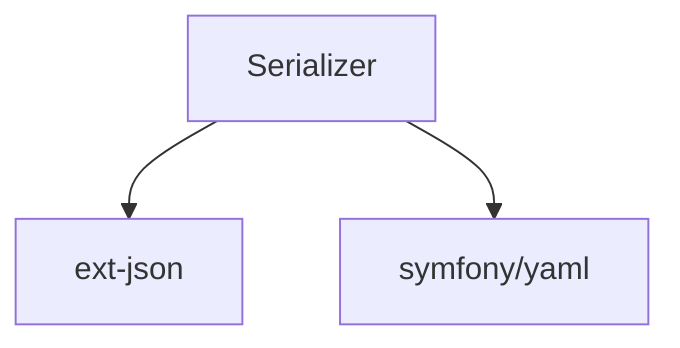

# Serializer

[](https://github.com/byjg/serializer/actions/workflows/phpunit.yml)
[](http://opensource.byjg.com)
[](https://github.com/byjg/serializer/)
[](https://opensource.byjg.com/opensource/licensing.html)
[](https://github.com/byjg/serializer/releases/)

Serialize any object into array and format it JSON, YAML or XML

## Converting any object/content into array

Just use the Serializer class with any kind of object, stdClass or array;

```php
<?php
$result = \ByJG\Serializer\SerializerObject::instance($data)->serialize();
$result2 = \ByJG\Serializer\SerializerObject::instance($anyJsonString)->fromJson()->serialize();
$result3 = \ByJG\Serializer\SerializerObject::instance($anyYamlString)->fromYaml()->serialize();
```

In the examples above `$result`, `$result2` and `$result3` will be an associative array.

## Formatting an array into JSON, YAML or ZML

```php
<?php
$data = [ ... any array content ... ]

echo (new JsonFormatter())->process($data);
echo (new XmlFormatter())->process($data);
echo (new YamlFormatter())->process($data);
echo (new PlainTextFormatter())->process($data);
```

## Customizing the Serialization

### Ignore null elements: `withDoNotSerializeNull()`

The SerializerObject brings all properties by default. For example:

```php
<?php
$myclass->setName('Joao');
$myclass->setAge(null);

$serializer = new \ByJG\Serializer\SerializerObject($myclass);
$result = $serializer->serialize();
print_r($result);

// Will return:
// Array
// (
//     [name] => Joao
//     [age] => 
// )
```

But you can setup for ignore the null elements:

```php
<?php
$result = \ByJG\Serializer\SerializerObject::instance($myclass)
            ->withDoNotSerializeNull()
            ->serialize();
print_r($result);

// And the result will be:
// Array
// (
//     [name] => Joao
// )

```

### Do not parse some classes: `withDoNotParse([object])`

Sometimes we want to serialize the object but ignore some class types.

Setting this option below the whole classes defined in the setDoNotParse will be ignored and not parsed:

```php
<?php
$result = \ByJG\Serializer\SerializerObject::instance($myclass)
            ->withDoNotParse([
                MyClass::class
            ])
            ->serialize();
```


## Create a *bindable* object

Add to the object the method `bind` that allows set contents from another object

```php
<?php
// Create the class
class MyClass extends BindableObject
{}

// Bind any data into the properties of myclass
$myclass->bindFrom($data);

// You can convert to array all properties
$myclass->bindTo($otherobject);
```

## Copy contents from any object to another

```php
// Set all properties from $source that matches with the property in $target
BinderObject::bind($source, $target);

// Convert all properties of any object into array
SerializerObject::serialize($source);
```

## Install

```
composer require "byjg/serialize=2.0.*"
```

## Test

```
phpunit
```

## Dependencies



----
[Open source ByJG](http://opensource.byjg.com)
