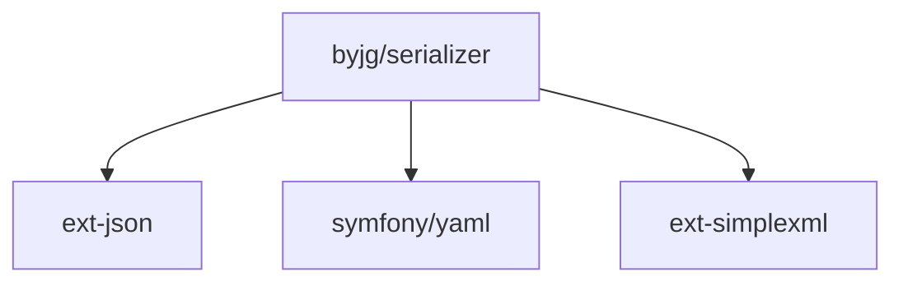

# PHP Serializer

[](https://github.com/byjg/php-serializer/actions/workflows/phpunit.yml)
[](http://opensource.byjg.com)
[](https://github.com/byjg/php-serializer/)
[](https://opensource.byjg.com/opensource/licensing.html)
[](https://github.com/byjg/php-serializer/releases/)

A powerful PHP library for seamless object serialization, conversion, and property manipulation.

## Features

- **Format Conversion**: Transform objects to JSON, XML, YAML, or Arrays, and back again
- **Property Control**: Filter, transform, and manipulate object properties during conversion
- **Object Mapping**: Copy properties between different object structures with intelligent mapping
- **Property Pattern Matching**: Customize how properties are matched and transformed
- **Attribute Support**: Process PHP attributes during serialization and deserialization
- **Type Safety**: Maintain data types during transformations

## Quick Examples

### Convert an object to JSON

```php
$object = new MyClass();
$json = \ByJG\Serializer\Serialize::from($object)
    ->toJson();
```

### Copy properties between objects

```php
$source = ["id" => 1, "name" => "John"];
$target = new User();
\ByJG\Serializer\ObjectCopy::copy($source, $target);
```

### Create a copyable object

```php
class User implements \ByJG\Serializer\ObjectCopyInterface
{
    use \ByJG\Serializer\ObjectCopyTrait;
    
    public $id;
    public $name;
    
    // Automatically inherits copyFrom() and copyTo() methods
}
```

## Documentation

### Core Components

| Component               | Description                                                     | Link                                         |
|-------------------------|-----------------------------------------------------------------|----------------------------------------------|
| **Serialize**           | Core component for converting objects between formats           | [Documentation](docs/serialize.md)           |
| **ObjectCopy**          | Final utility class for copying properties between objects      | [Documentation](docs/objectcopy.md)          |
| **ObjectCopyTrait**     | Trait implementing copyable object functionality                | [Documentation](docs/objectcopytrait.md)     |
| **ObjectCopyInterface** | Interface for implementing copyable objects                     | [Documentation](docs/objectcopyinterface.md) |
| **BaseModel**           | Abstract base class with object copying functionality           | [Documentation](docs/basemodel.md)           |
| **DirectTransform**     | Basic property handler for direct transformations in ObjectCopy | [Documentation](docs/directtransform.md)     |

### Guides

- **[Formatters](docs/formatters.md)** - JSON, XML, YAML, CSV, and Plain Text output formatting
- **[Property Handlers](docs/propertyhandlers.md)** - Transform property names and values during copying
- **[Advanced Usage](docs/advanced-usage.md)** - Performance optimization, security, and complex patterns
- **[Integration Examples](docs/integration-examples.md)** - Framework integration (Symfony, Laravel, Doctrine, etc.)
- **[ByJG Ecosystem](docs/byjg-ecosystem.md)** - How Serializer integrates with other ByJG components
- **[Troubleshooting](docs/troubleshooting.md)** - Common issues and solutions


## Installation

```bash
composer require "byjg/serializer"
```

## Testing

```bash
./vendor/bin/phpunit
```

## Dependencies



----
[Open source ByJG](http://opensource.byjg.com)
