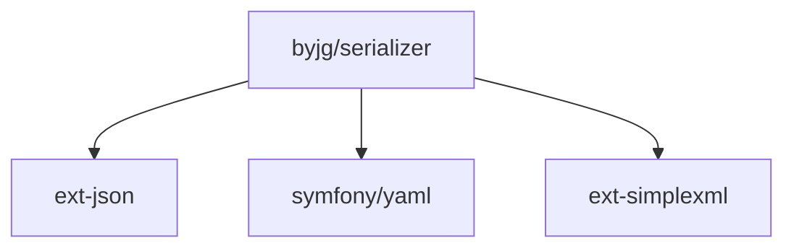

# Serializer

[](https://github.com/byjg/serializer/actions/workflows/phpunit.yml)
[](http://opensource.byjg.com)
[](https://github.com/byjg/serializer/)
[](https://opensource.byjg.com/opensource/licensing.html)
[](https://github.com/byjg/serializer/releases/)

The Serializer library is a versatile tool that allows you to convert any object, array, or `stdClass` 
into JSON, XML, YAML, or an array. It also enables you to apply filters to properties during 
the conversion process. Additionally, you can parse attributes and apply transformations to property 
values on the fly.

The library also allows you to copy content from one object to another, even if their properties differ.

For more information, please check:

- [Serialize](docs/serialize.md)
- [ObjectCopy](docs/objectcopy.md)
- [ObjectCopyInterface](docs/objectcopyinterface.md)


## Install

```
composer require "byjg/serialize"
```

## Test

```
./vendor/bin/phpunit
```

## Dependencies



----
[Open source ByJG](http://opensource.byjg.com)
