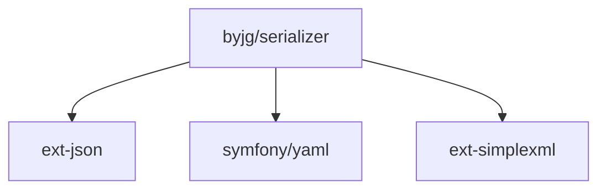

# Serializer

[](https://github.com/byjg/serializer/actions/workflows/phpunit.yml)
[](http://opensource.byjg.com)
[](https://github.com/byjg/serializer/)
[](https://opensource.byjg.com/opensource/licensing.html)
[](https://github.com/byjg/serializer/releases/)

The Serializer is a library is a versatile tool that allows you convert any object, array or stdClass 
to JSON, XML, YAML, and Array, and apply some filter to the properties. During the conversion you can
parse attributes and apply some transformation to the property values on the fly.

Also allow you to copy contents from an object to another, even if they have different properties.

For more information, please check:

- [Serialize](docs/serialize.md)
- [ObjectCopy](docs/objectcopy.md)
- [ObjectCopyInterface](docs/objectcopyinterface.md)


## Install

```
composer require "byjg/serialize"
```

## Test

```
./vendor/bin/phpunit
```

## Dependencies



----
[Open source ByJG](http://opensource.byjg.com)
