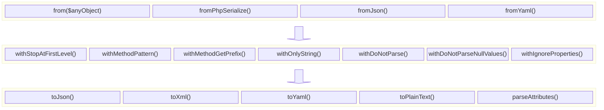

# Serialize class

Using the `Serialize` class, you can convert any object into an array or other formats.

During the process, you can apply modifiers to customize the serialization.

Here is how `Serialize` works:



## Examples

### Converting any object/content into an array

Just use the `Serialize` class with any kind of object, `stdClass`, or array:

```php
<?php
$result = \ByJG\Serializer\Serialize::from($data)->toArray();
$result2 = \ByJG\Serializer\Serialize::fromPhpSerialize($anyPhpSerializedString)->toArray();
$result3 = \ByJG\Serializer\Serialize::fromJson($anyJsonString)->toArray();
$result4 = \ByJG\Serializer\Serialize::fromYaml($anyYamlString)->toArray();
```

In the examples above, `$result`, `$result2`, `$result3`, and `$result4` will be associative arrays.

### Formatting an array into JSON, YAML or ZML

```php
<?php
$data = [ ... any array content ... ]

echo (new JsonFormatter())->process($data);
echo (new XmlFormatter())->process($data);
echo (new YamlFormatter())->process($data);
echo (new PlainTextFormatter())->process($data);
```

Alternatively, you can call directly from the `Serialize` class:

```php
<?php
$data = [ ... any array content ... ]

echo Serialize::from($data)->toJson();
echo Serialize::from($data)->toXml();
echo Serialize::from($data)->toYaml();
echo Serialize::from($data)->toPlainText();
echo Serialize::from($data)->parseAttributes($attributeClass, $flags, fn($instanceAttribute, $parsedValue, $propertyName));
```

### Customizing the Serialization

These are the possible modifiers for parsing:

| Method                   | Description                                     |
|--------------------------|-------------------------------------------------|
| withDoNotParseNullValues | Ignore null elements                            |
| withDoNotParse           | Ignore some classes and return them as is       |
| withOnlyString           | Return only string elements                     |
| withMethodPattern        | use the pattern to convert method into property |


#### Ignore null elements: `withDoNotParseNullValues()`

By default, the `Serialize` class includes all properties. For example:

```php
<?php
$myclass->setName('Joao');
$myclass->setAge(null);

$serializer = new \ByJG\Serializer\Serialize($myclass);
$result = $serializer->toArray();
print_r($result);

// Will return:
// Array
// (
//     [name] => Joao
//     [age] => 
// )
```

To ignore null elements:

```php
<?php
$result = \ByJG\Serializer\Serialize::from($myclass)
            ->withDoNotParseNullValues()
            ->toArray();
print_r($result);

// And the result will be:
// Array
// (
//     [name] => Joao
// )

```

#### Do not parse specific classes: `withDoNotParse([object])`

To serialize an object but ignore specific class types:

```php
<?php
$result = \ByJG\Serializer\Serialize::from($myclass)
            ->withDoNotParse([
                MyClass::class
            ])
            ->toArray();
```

#### Return only string elements: `withOnlyString()`

To serialize an object and return only string elements:

```php
<?php
$model = new stdClass();
$model->varFalse = false;
$model->varTrue = true;
$model->varZero = 0;
$model->varZeroStr = '0';
$model->varNull = null;
$model->varEmptyString = '';

$result = \ByJG\Serializer\Serialize::from($myclass)
            ->withOnlyString()
            ->toArray();

// It will return:
// Array
// (
//     [varFalse] => ''
//     [varTrue] => '1'
//     [varZero] => '0'
//     [varZeroStr] => '0'
//     [varNull] => ''
//     [varEmptyString] => ''
// )
``` 

#### Use the pattern to convert method into properties: `withMethodPattern($pattern, $replace)`

In the class we might have the name `property` name different from the getter method.

The default configuration is to remove everything in the `property`
that doesn't match with the `$pattern = '/([^A-Za-z0-9])/'`

If you need something different you can use the `withMethodPattern` to define your own pattern.

#### parseAttributes

You can parse the attributes of an object using the `parseAttributes` method.
This method will search for an specific attribute in the object and will parse it using the `$attributeClass` and `$flags` parameters.
For every property it will call the callback function with the instance attribute if it was found and the parsed value.

```php
class Model
{
    public $Id = "";
    #[SampleAttribute("Message")]
    public $Name = "";
}

$model = new Model();
$model->Id = "123";
$model->Name = "John";

$result = Serialize::from($data)
            ->parseAttributes(
                function ($attribute, $value, $keyName, $propertyName, $getterName) {
                    return "$value: " . $attribute?->getElementName();
                },
                SampleAttribute::class, 
            );

// Will return:
// Array
// (
//     [Id] => "123: "
//     [Name] => "John: Message"
// )
```
