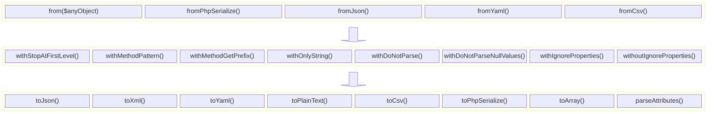

# Serialize class

Using the `Serialize` class, you can convert any object into an array or other formats.

During the process, you can apply modifiers to customize the serialization.

Here is how `Serialize` works:



## Examples

### Converting any object/content into an array

Just use the `Serialize` class with any kind of object, `stdClass`, or array:

#### Basic Conversion

```php
<?php
$result = \ByJG\Serializer\Serialize::from($data)->toArray();
$result2 = \ByJG\Serializer\Serialize::fromPhpSerialize($anyPhpSerializedString)->toArray();
$result3 = \ByJG\Serializer\Serialize::fromJson($anyJsonString)->toArray();
$result4 = \ByJG\Serializer\Serialize::fromYaml($anyYamlString)->toArray();
$result5 = \ByJG\Serializer\Serialize::fromCsv($anyCsvString)->toArray();
```

In the examples above, `$result`, `$result2`, `$result3`, `$result4`, and `$result5` will be associative arrays.

#### CSV Conversion with Headers

When working with CSV data, you can specify whether the CSV has a header row:

```php
<?php
// With headers (default)
$result = \ByJG\Serializer\Serialize::fromCsv($csvWithHeaders)->toArray();

// Without headers
$result = \ByJG\Serializer\Serialize::fromCsv($csvWithoutHeaders, false)->toArray();
```

When `hasHeader` is set to `true` (default), the first row of the CSV is treated as column names, and each subsequent row is converted to an associative array using these column names as keys. When `hasHeader` is set to `false`, each row is treated as a simple indexed array.

### Formatting an array into JSON, YAML, XML, CSV, or Plain Text

```php
<?php
$data = [ ... any array content ... ]

echo (new JsonFormatter())->process($data);
echo (new XmlFormatter())->process($data);
echo (new YamlFormatter())->process($data);
echo (new CsvFormatter())->process($data);
echo (new PlainTextFormatter())->process($data);
```

Alternatively, you can call directly from the `Serialize` class:

```php
<?php
$data = [ ... any array content ... ]

echo Serialize::from($data)->toJson();
echo Serialize::from($data)->toXml();
echo Serialize::from($data)->toYaml();
echo Serialize::from($data)->toCsv();
echo Serialize::from($data)->toPlainText();
echo Serialize::from($data)->toPhpSerialize(); // Serialize to PHP's native serialization format
echo Serialize::from($data)->parseAttributes($attributeClass, $flags, fn($instanceAttribute, $parsedValue, $propertyName));
```

### Customizing the Serialization

These are the possible modifiers for parsing:

| Method                   | Description                                                  |
|--------------------------|--------------------------------------------------------------|
| withDoNotParseNullValues | Ignore null elements                                         |
| withDoNotParse           | Ignore some classes and return them as is                    |
| withOnlyString           | Return only string elements                                  |
| withMethodPattern        | Use the pattern to convert method into property              |
| withMethodGetPrefix      | Set the prefix for getter methods (default is 'get')         |
| withStopAtFirstLevel     | Only parse the first level of nested objects                 |
| withIgnoreProperties     | Specify properties to ignore during serialization            |
| withoutIgnoreProperties  | Clear the list of properties to ignore during serialization  |

#### Ignore null elements: `withDoNotParseNullValues()`

By default, the `Serialize` class includes all properties. For example:

```php
<?php
$myclass->setName('Joao');
$myclass->setAge(null);

$serializer = new \ByJG\Serializer\Serialize($myclass);
$result = $serializer->toArray();
print_r($result);

// Will return:
// Array
// (
//     [name] => Joao
//     [age] => 
// )
```

To ignore null elements:

```php
<?php
$result = \ByJG\Serializer\Serialize::from($myclass)
            ->withDoNotParseNullValues()
            ->toArray();
print_r($result);

// And the result will be:
// Array
// (
//     [name] => Joao
// )

```

#### Do not parse specific classes: `withDoNotParse([object])`

To serialize an object but ignore specific class types:

```php
<?php
$result = \ByJG\Serializer\Serialize::from($myclass)
            ->withDoNotParse([
                MyClass::class
            ])
            ->toArray();
```

#### Return only string elements: `withOnlyString()`

To serialize an object and return only string elements:

```php
<?php
$model = new stdClass();
$model->varFalse = false;
$model->varTrue = true;
$model->varZero = 0;
$model->varZeroStr = '0';
$model->varNull = null;
$model->varEmptyString = '';

$result = \ByJG\Serializer\Serialize::from($myclass)
            ->withOnlyString()
            ->toArray();

// It will return:
// Array
// (
//     [varFalse] => ''
//     [varTrue] => '1'
//     [varZero] => '0'
//     [varZeroStr] => '0'
//     [varNull] => ''
//     [varEmptyString] => ''
// )
``` 

#### Use the pattern to convert method into properties: `withMethodPattern($pattern, $replace)`

In the class we might have the name `property` name different from the getter method.

The default configuration is to remove everything in the `property`
that doesn't match with the `$pattern = '/([^A-Za-z0-9])/'`

If you need something different you can use the `withMethodPattern` to define your own pattern.

#### Set the prefix for getter methods: `withMethodGetPrefix($prefix)`

By default, the `Serialize` class uses 'get' as the prefix for getter methods. You can change this using the `withMethodGetPrefix` method:

```php
<?php
$result = \ByJG\Serializer\Serialize::from($myclass)
            ->withMethodGetPrefix('fetch')
            ->toArray();
```

#### Only parse the first level of nested objects: `withStopAtFirstLevel()`

To only parse the first level of nested objects:

```php
<?php
$result = \ByJG\Serializer\Serialize::from($myclass)
            ->withStopAtFirstLevel()
            ->toArray();
```

#### Ignore specific properties: `withIgnoreProperties([$prop1, $prop2])`

To ignore specific properties during serialization:

```php
<?php
$result = \ByJG\Serializer\Serialize::from($myclass)
            ->withIgnoreProperties(['password', 'secretKey'])
            ->toArray();
```

#### Clear the list of ignored properties: `withoutIgnoreProperties()`

To clear the list of properties to ignore:

```php
<?php
$result = \ByJG\Serializer\Serialize::from($myclass)
            ->withIgnoreProperties(['password'])
            ->withoutIgnoreProperties() // Clear the ignore list
            ->toArray();
```

#### parseAttributes

You can parse the attributes of an object using the `parseAttributes` method.
This method will search for a specific attribute in the object and will parse it using the `$attributeClass` parameter.
For every property it will call the callback function with the instance attribute if it was found and the parsed value.

```php
/**
 * @param Closure|null $attributeFunction A callback function to process attributes
 * @param string|null $attributeClass Optional class name of attribute to filter by
 * @return array The processed properties array
 */
public function parseAttributes(?Closure $attributeFunction, ?string $attributeClass = null): array
```

The callback function receives these parameters:
- `$attribute`: The attribute instance if found, or null
- `$value`: The parsed value of the property
- `$keyName`: The property key name in the array
- `$propertyName`: The original property name
- `$getterName`: The getter method name if it exists

Example:

```php
class Model
{
    public $Id = "";
    #[SampleAttribute("Message")]
    public $Name = "";
}

$model = new Model();
$model->Id = "123";
$model->Name = "John";

$result = Serialize::from($model)
            ->parseAttributes(
                function ($attribute, $value, $keyName, $propertyName, $getterName) {
                    return "$value: " . $attribute?->getElementName();
                },
                SampleAttribute::class
            );

// Will return:
// Array
// (
//     [Id] => "123: "
//     [Name] => "John: Message"
// )
```

This method is particularly useful when working with PHP 8 attributes to customize serialization based on metadata annotations.

## Related Components

The PHP Serializer library includes several other components to help with object manipulation:

- **ObjectCopy**: [See dedicated documentation](objectcopy.md)
- **ObjectCopyTrait**: [See dedicated documentation](objectcopytrait.md)
- **BaseModel**: [See dedicated documentation](basemodel.md)
- **DirectTransform**: [See dedicated documentation](directtransform.md)
